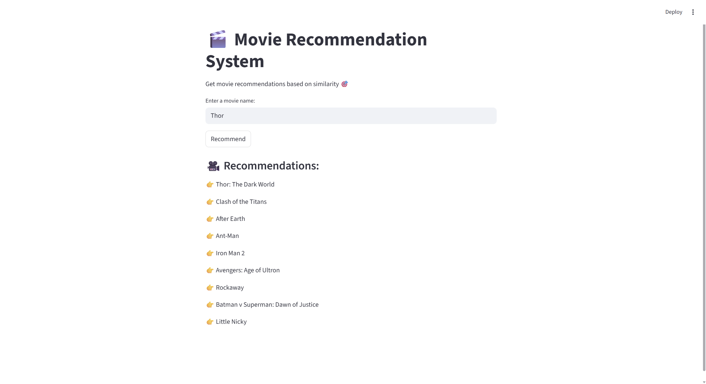

# 🎬 Movie Recommendation System

A **content-based movie recommendation system** built using Python, Natural Language Processing (NLP), and machine learning techniques to suggest movies based on similarity.

---

## 📌 Overview

This project recommends movies similar to a given movie by analyzing content such as:

* Genres
* Keywords
* Cast
* Director
* Movie overview

It uses NLP and vector similarity techniques to identify movies with similar characteristics.

---

## 🚀 Features

* 🎯 Recommend movies based on content similarity
* 🧠 Uses NLP for text preprocessing
* 🎭 Considers genres, keywords, cast, and director
* ⚡ Fast and efficient recommendation system
* ❌ Handles invalid inputs gracefully

---

## 🧠 How It Works

1. Load and merge movie datasets
2. Clean and preprocess data
3. Extract key features (genres, keywords, cast, director)
4. Combine all features into a single **"tags" column**
5. Convert text into numerical vectors using **CountVectorizer**
6. Compute similarity using **cosine similarity**
7. Recommend top similar movies

---

## 🛠️ Technologies Used

* Python
* Pandas
* Scikit-learn
* NLTK

---

## 📥 Dataset

This project uses the **TMDB 5000 Movie Dataset**.

🔗 Download from Kaggle:
https://www.kaggle.com/datasets/tmdb/tmdb-movie-metadata

The dataset contains metadata for ~5000 movies including:

* Genres
* Cast
* Crew
* Keywords
* Overview

📌 After downloading, place the CSV files in the project directory before running the code.

---

## ▶️ How to Run

1. Clone the repository:

```
git clone https://github.com/charankotta32-star/movie-recommendation-system.git
```

2. Install dependencies:

```
pip install -r requirements.txt
```

3. Run the program:

```
python main.py
```

---

## 📌 Example

### Input

```
recommend("Avatar")
```

### Output

```
Aliens vs Predator: Requiem  
Aliens  
Independence Day  
Titan A.E.  
Predators  
```

---

## 💡 Future Improvements

* 🌐 Build a web interface (Streamlit / Flask)
* 📊 Use TF-IDF for improved accuracy
* 🔗 Integrate TMDB API for real-time data
* 📈 Enhance recommendation quality

---

## 📸 Demo


---

## 👨‍💻 Author

**Charan Ram Sai**
B.Tech CSE (AI & ML), SRM University

