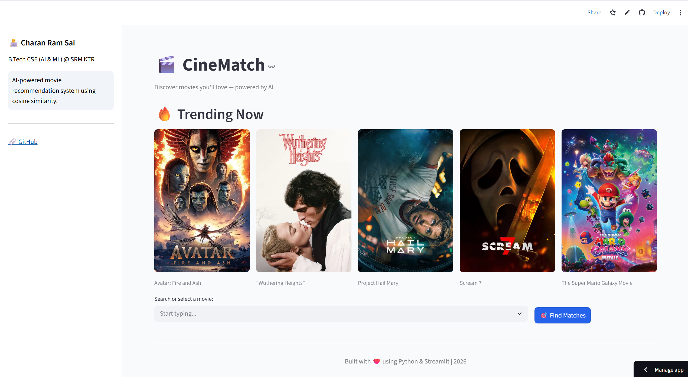
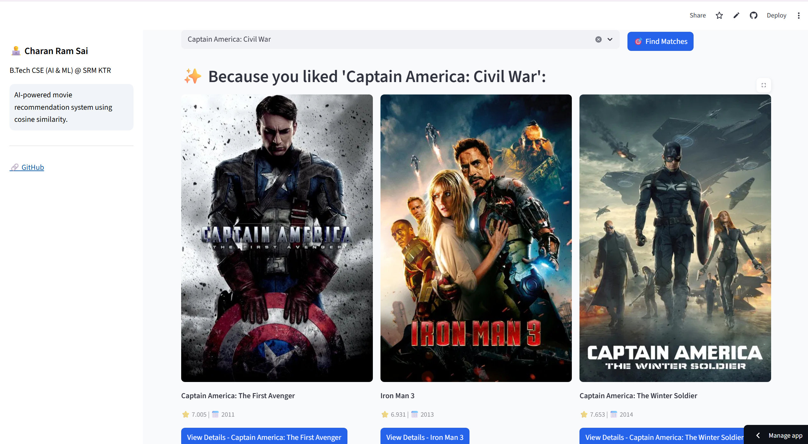
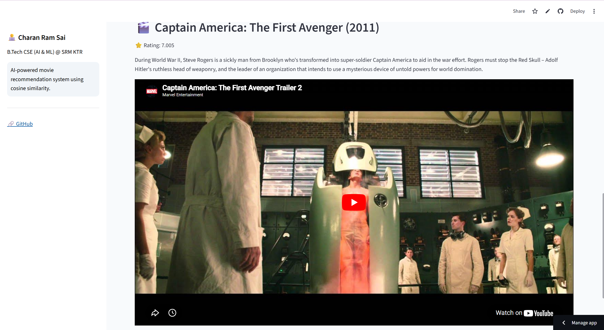

# 🎬 CineMatch – AI Movie Recommendation System

CineMatch is an AI-powered movie recommendation web app that suggests movies based on your preferences using content-based filtering and cosine similarity.

---

## 🚀 Live Demo

👉 https://movie-recommendation-system-mgbywxwexappja543tp7j7n.streamlit.app/

---

## ✨ Features

* 🎯 Personalized movie recommendations
* 🔥 Trending movies section (TMDB API)
* 🎬 Movie posters, ratings & release year
* 📽️ Watch movie trailers directly
* ⚡ Fast and responsive UI
* 🧠 Content-based filtering (ML)

---

## 🧠 Tech Stack

* Python
* Streamlit
* Pandas, NumPy
* Scikit-learn
* NLTK
* TMDB API

---

## 📸 Screenshots

### 🔥 Home + Trending



### 🎯 Recommendations



### 🎬 Movie Details + Trailer



---

## 🎥 Demo Video

👉 https://drive.google.com/file/d/1E24Dyk4gFrHHZGqzyedi7AgT6XNBz5K_/view?usp=sharing

---

## ⚙️ How It Works

1. Movie dataset is processed (genres, cast, keywords)
2. Text data is converted into vectors using CountVectorizer
3. Cosine similarity is calculated between movies
4. Similar movies are recommended instantly

---

## 🛠️ Installation

```bash
git clone https://github.com/your-username/movie-recommendation-system.git
cd movie-recommendation-system
pip install -r requirements.txt
streamlit run app.py
```

---

## 🔐 API Key Setup

Create a `.env` or use Streamlit secrets:

```
TMDB_API_KEY=your_api_key_here
```

---

## 👨‍💻 Author

**Charan Ram Sai**
B.Tech CSE (AI & ML) @ SRM KTR

🔗 GitHub: https://github.com/charankotta32-star

---

## 🌟 Future Improvements

* 🔍 Smart search (no dropdown)
* 🎨 Advanced UI animations
* 📊 Better recommendation model
* 🌐 Full-stack deployment

---

## ⭐ If you like this project, give it a star!
